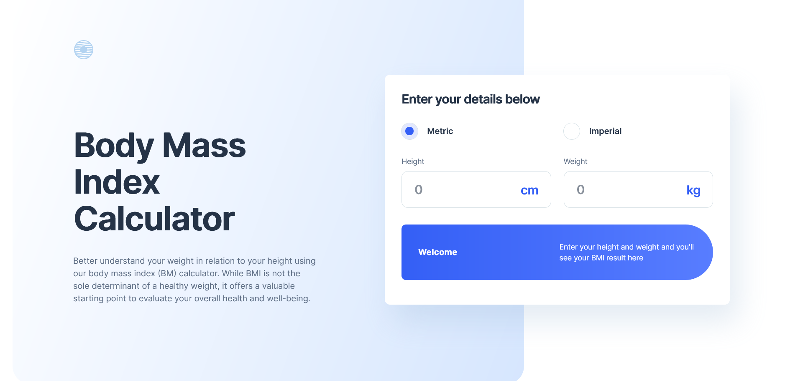

# Frontend Mentor - Body Mass Index Calculator solution

This is a solution to the [Body Mass Index Calculator challenge on Frontend Mentor](https://www.frontendmentor.io/challenges/body-mass-index-calculator-brrBkfSz1T). Frontend Mentor challenges help you improve your coding skills by building realistic projects. 

## Table of contents

  - [Screenshot](#screenshot)
  - [Links](#links)
  - [Built with](#built-with)
  - [Author](#author)

### Screenshot

### Links

- Solution URL: [https://www.frontendmentor.io/solutions/bmi-calculator-vanilla-js-mq-ufNyPiG]
- Live Site URL: [https://d-sisovic.github.io/BMI-Calculator/]

### Built with

- Semantic HTML5 markup
- SCSS
- Flexbox
- Mobile-first workflow
- Vanilla JS

### Author

Daniel Sisovic